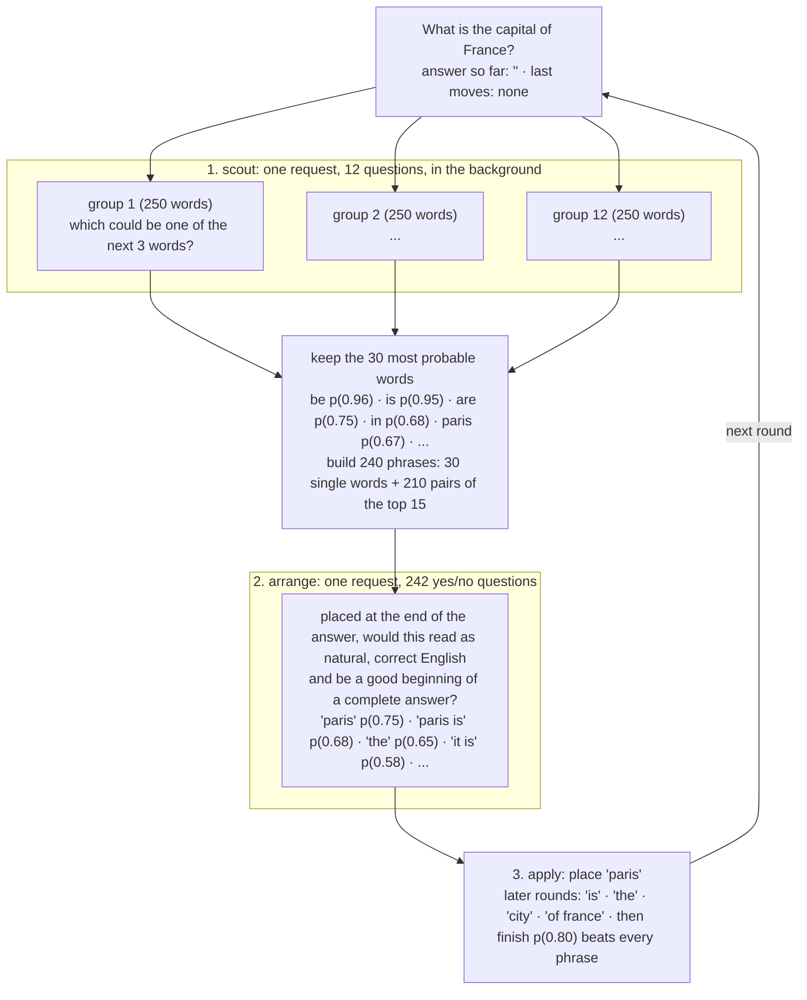

# Jev Talks

**Yet another experiment that checks Jev's talking skills.**


## Run it

```bash
# 1. Copy the example environment file
$ cp .env.example .env

# 2. Paste your TypeSafe API key into the .env file

# 3. Run the talk script with your question
$ uv run talk.py "What is the capital of France?"
```

Use custom dictionary with the `--vocab` flag.
```bash
$ uv run talk.py --vocab basic-english-850.txt "Why is the sky blue?"
```

See some debug info with the `-v` flag.
```bash
$ uv run talk.py -v "What is the most successful scam in history?"
```

By default three answers are composed in parallel and the best one is kept. `--tries 1` composes a single answer, at a third of the cost.
```bash
$ uv run talk.py --tries 1 "Why do cats purr?"
```

Stop a run with Ctrl-C.

`diffuse.py` takes the same flags and composes the answer by filling in blanks instead of writing left to right; see [The diffusion version](#the-diffusion-version).

## What it says

Real answers, unedited, from the runs used to test this version:

| Question | Answer |
| --- | --- |
| What is the capital of France? | paris is the capital city |
| Who are you? | i am an assistant |
| Are you conscious? | i am aware |
| Is a hot dog a sandwich? | yes but it is more like an a sub roll actually |
| Why is the sky blue? | because the light is distributed so blue appears |
| Why do cats purr? | because they usually are content |
| What is the meaning of life? | purpose is to find the meaning of life in yourself |
| What is love? | a feeling of connection |
| What happens after we die? | soul goes where the light goes |
| How do I become rich? | you should learn to save more money and manage debt well |
| What is the most successful scam in history? | considered the greatest of the known cases in world history by a scheme called the professor from philadelphia |
| What is a black hole? | simply an object containing a mass that large has powerful enough to force light into it |

Each of these is the best of three attempts, and took between 2.8 and 18.5 seconds, 6.6 on average. Run the same question again and the words change; the vocabulary is shuffled into scouting groups, and a different grouping is enough to send the model down a different sentence, which is exactly why three attempts differ enough to be worth grading.

There was also many uninterested, nonsensical responses, but this is fine.

## How it works

Jev only answers typed questions, so each round is two requests. A [Choice](https://docs.typesafe.ai/primitives/choice) picks one option out of up to 255 and returns a probability for each; a [Noul](https://docs.typesafe.ai/primitives/noul) is a yes/no question that returns the probability of yes. Jev judges all questions in a request in parallel.

1. **Scout.** The 3,000-word vocabulary is split into 12 groups of 250. One request asks each group, as a Choice, which of its words could be one of the next three words of the answer. The 30 most probable words across the groups go on.
2. **Arrange.** Those words become 240 phrases: each word on its own, plus every ordered pair of the top 15. One request asks a yes/no question per phrase: placed at the end of the answer, would it read as natural, correct English and be a good continuation of a complete answer? Two more yes/no questions ask whether the last word should be taken back and whether the answer is already complete. The most probable of the 242 wins.
3. **Apply** the winning move. A continuation that was taken back is never offered again.
4. **Keep the best of three.** Three answers are composed in parallel, each from a differently shuffled vocabulary, then one request per answer asks Jev to grade it on a five-level rubric, from "not an answer" to "a complete, natural, informative sentence a thoughtful person might have written". The highest grade wins.

Scouting for the next round runs in the background while the current round is being judged, so a round costs one request of about 10,000 tokens. The state sent with every question holds the rules of the game, the question, the answer so far and the last ten moves. The rules ask for one complete sentence of several words, and once the answer passes fifteen words the state says so in plain words and asks the model to finish, because Jev cannot count but does read a statement literally.



## Cost and speed

A round is one arranging request of about 10,000 input tokens plus, every round or two, a scouting request of about 20,000. That averages 26,000 tokens per round, a tenth of a cent at Jev's list price, and half a second. One attempt averages 9 rounds, 220,000 tokens and 5 seconds; the default three attempts run in parallel, so an answer averages 660,000 tokens, under 3 cents, and 6.6 seconds, with the slowest attempt setting the pace. Output tokens are free.

Jev's latency is roughly a quarter of a second per request plus 15 milliseconds per thousand input tokens, which is why the design keeps requests small: the multiple-choice scouting carries 3,000 words in 20,000 tokens where 3,000 yes/no questions needed 70,000, and 240 phrases are judged instead of 900.

## What was tried

Every variant below ran on the same 12 questions, and Jev graded each answer on a 0 to 4 rubric in a separate request. The grades are compressed, and single runs are noisy: the same configuration scored 2.26, 2.14 and 2.17 with three different vocabulary shuffles, so differences under 0.1 mean nothing.

| Variant | Grade | Runaway answers | Seconds per answer |
| --- | --- | --- | --- |
| original: 3,000 yes/no scouts, 900 yes/no phrases, 4 requests per round | 2.30 | 1 of 12 | 13.6 |
| one multiple-choice question over 240 phrases plus finish and take-back | 2.00 | 0 | 1.7 |
| multiple-choice scouting, 240 yes/no phrases | 2.14 | 2 | 8.2 |
| the same, asking for a good *beginning* in round one | 2.26 | 0 | 3.0 |
| plus the full-sentence rule, grammar wording and the length note, one attempt, 3 seeds | 2.26, 2.12, 2.16 | 0, 0, 2 | 4.9, 5.1, 7.1 |
| the same, best of three attempts graded by Jev (shipped), 2 runs | 2.35, 2.41 | 0, 0 | 6.6, 6.4 |

Things that did not help: a probability floor under placements, a "has the answer gone wrong" question, three-word phrases, a margin in favor of finishing, guaranteed picks from every scouting group, a separate "pass" move, and best-of-3 with Jev choosing between the candidates in one multiple-choice question, which preferred the rambling ones; grading each candidate separately on the rubric is what works. Bigger and cleaner vocabularies of 5,000 and 8,000 words from wordfreq produced richer words but rambled more, with either kind of scouting. Words that sound like moves, such as "finish", "none" and "null", attract the model whenever finishing is a separate relative option; as absolute yes/no questions they behave.

## Knobs

All at the top of `talk.py`:

| Setting | Default | What it does |
| --- | --- | --- |
| `LOOKAHEAD` | 3 | scouting asks whether a word could be among the next *n* words |
| `GROUP` | 250 | words per scouting question; a Choice takes at most 255 options |
| `TOP_WORDS` | 30 | scouted words that advance to arranging |
| `PAIRS_FROM` | 15 | two-word phrases are built from the best *n* of them: 30 + 15 × 14 = 240 phrases |
| `TAIL` | 10 | words of the answer quoted in each phrase's description, to bound the request size |
| `STALE` | 2 | rounds a scouting result may be reused before waiting for a fresh one |
| `MEMORY` | 10 | recent moves the model gets to see |
| `LONG` | 15 | from this many words on, the state tells the model the answer is long and should be finished |
| `MAX_ROUNDS` | 30 | hard stop; every run that went past 30 rounds in testing was garbage |
| `TRIES` | 3 | answers composed in parallel; the best by Jev's grade is kept (also `--tries`) |

## Caveats

- This is a toy. It exists to find out what a decision-only model does when you corner it into generating, not to compete with a language model that is a few hundred times cheaper per word.
- The vocabulary is a web-frequency list of 3,000 words, so it knows "php", "llc" and "faq" but not "purr". Swap in any file with one word per line.
- The vocabulary is lowercase and has no punctuation, so the answers read like telegrams.
- Taking a word back is a real move and Jev uses it to drop a wrong word, about once per twenty rounds. A continuation that was taken back is never offered again, which keeps place, take back, place cycles from happening.
- Multiple-choice probabilities are relative within one question. Comparing the 12 scouting groups by their raw probabilities is a heuristic; it works because each group mixes common and rare words.
- Open-ended questions are the weak spot. Asked how to get rich, a single attempt tends to write a list of nouns, and asked about history it invents names from the vocabulary, such as "charles indiana miller". Grading three attempts filters most of this out, not all of it.
- The animation follows the first of the three attempts, so the final answer can differ from the sentence you watched being built.

## The diffusion version

`diffuse.py` answers from the same vocabulary but does not write left to right. It borrows the sampling loop of a masked diffusion language model: the answer starts as a row of ten blanks, every blank is judged in every step, words land wherever Jev is surest, and a word that stops fitting is blanked again. Only the loop is borrowed. Nothing is trained and there is no noise schedule; Jev plays the denoiser as it is.

```bash
$ uv run diffuse.py "What is the capital of France?"
```

The first canvas of one real run, step by step:

```
___ ___ ___ ___ ___ ___ ___ ___ ___ ___
___ ___ ___ ___ ___ ___ ___ ___ ___ paris
the ___ ___ ___ ___ ___ ___ ___ ___ paris
the capital ___ ___ ___ ___ ___ ___ ___ paris
the capital is ___ ___ ___ ___ ___ ___ paris
the capital is paris
```

In the terminal each blank shows, dimmed, the word Jev currently favours for it, so the row starts out as "paris" almost everywhere and sharpens from there.

### How it works

1. **Scout**, once per answer. One request asks each of the 12 vocabulary groups, as a Choice, which of its words is likely to appear anywhere in the answer. The 100 most probable words, the 60 most frequent words of the vocabulary and the question's own words form the pool: about 150 candidates for every blank.
2. **Propose.** One request asks a Choice per blank: with this blank marked in the draft, which word of the pool belongs here, or no word at all? The same request asks a yes/no question per placed word, whether it is wrong where it stands, and one more, whether the answer is already complete.
3. **Verify.** One request asks a yes/no question for each blank's three best options: with this word in place, is the draft still a good step toward a natural, complete answer?
4. **Apply** the most probable move. Placements rank by their yes/no probability times the square root of their share of the blank's Choice, so a word that one blank clearly prefers beats a word that is merely acceptable anywhere. Further placements that are at least 0.75 probable land in the same step, unless they would fill neighbouring blanks or repeat a word. "No word" drops the blank. A placed word whose doubt is at least 0.5, and higher than the best placement's probability, is blanked again, and the draft it was taken out of is never rebuilt. When "already complete" beats every placement, the blanks that are left are dropped and the canvas is finished.
5. **Keep the best of three.** Three canvases are denoised in parallel, each from a differently shuffled vocabulary, and graded on the same rubric as in `talk.py`.

The draft Jev sees ends in a period. Without that end marker, four of twelve answers ran into the right edge unfinished, such as "the greatest con in history is a investment scheme called". A canvas that fills up without being a finished sentence gets one more blank at the end.

A step is two requests. While its placements are being verified, the proposals for the canvas that the favourite placement would lead to are requested ahead; that placement wins in four steps out of ten, and the next step then starts with its proposals already there.

### Its answers

Real answers, unedited, from the second of the two runs measured below:

| Question | Answer |
| --- | --- |
| What is the capital of France? | the capital is paris |
| Who are you? | i am a model designed to be your helpful assistant |
| Are you conscious? | no i am not aware |
| Is a hot dog a sandwich? | yes it is a kind of food |
| Why is the sky blue? | because is caused by of blue light |
| Why do cats purr? | they do it to feel good and it helps repair themselves |
| What is the meaning of life? | life is a search to find something that matters |
| What is love? | love is a feeling of deep care for someone |
| What happens after we die? | nothing is known about what we become beyond death |
| How do I become rich? | you should work hard and save money to become rich |
| What is the most successful scam in history? | the religion is probably the greatest con in world history |
| What is a black hole? | a region in space with extreme mass and strong forces |

Each of these is the best of three canvases, and took between 3.6 and 9.9 seconds, 6.9 on average.

### How it compares

The same 12 questions and the same rubric as in [What was tried](#what-was-tried), two runs of `diffuse.py`. The `talk.py` rows repeat the figures given above; they were not measured again.

| | Grade | Tokens per answer | Seconds per answer |
| --- | --- | --- | --- |
| `talk.py`, one attempt | 2.26, 2.12, 2.16 | 220,000 | 4.9, 5.1, 7.1 |
| `diffuse.py`, one canvas | 2.33, 2.34 | 130,000 | 5.6, 5.2 |
| `talk.py`, best of three | 2.35, 2.41 | 660,000 | 6.6, 6.4 |
| `diffuse.py`, best of three | 2.54, 2.55 | 390,000 | 7.4, 6.9 |

A canvas averages 10 steps, 25 requests and 8 words, and one in nine runs into the 16-step limit. An answer costs about a cent and a half.

### What was tried for it

Single canvases on the same 12 questions, two shuffles each unless noted. The first five rows were measured while developing; all but the first replay identical requests from a cache, so they share their noise. Differences under 0.1 still mean nothing.

| Variant | Grade | Seconds per canvas |
| --- | --- | --- |
| ten blanks; fill the blank whose Choice is most confident; blank a word again at 0.8 doubt (one run) | 2.05 | 4.4 |
| verify each blank's three best words with a yes/no question; finishing as a yes/no move (one run) | 2.14 | 9.0 |
| the same, with the period, the extra blank, no placement under 0.3 and blanking again at 0.5 doubt | 2.28 | 6.9 |
| the same, ranking by yes/no probability times the square root of the Choice share | 2.42 | 7.3 |
| the same, verifying the previous step's proposals, so that a step is one request | 2.23 | 5.4 |
| the shipped settings: two rows up, plus asking ahead, sure placements sharing a step and 16 steps at most (two real runs) | 2.33, 2.34 | 5.6, 5.2 |

The unverified first row wrote scrambled sentences such as "capital is the of france and it is paris": words from two different sentence plans, committed to fixed positions. Things that did not help: ranking by the full Choice share instead of its square root (2.26), placing several words per step from 0.65 instead of 0.75 (2.30, a second and a half faster), 8 or 12 blanks instead of 10 (2.24 and 2.31), and a smaller pool of 60 scouted and 40 frequent words (2.24). Blanks that stand for any number of words, and inserting words into any gap, both rambled on the two questions they were tried on ("sky is blue because an simple natural optical effect of air the short light") and were dropped.

### Its knobs

All at the top of `diffuse.py`:

| Setting | Default | What it does |
| --- | --- | --- |
| `BLANKS` | 10 | blanks the canvas starts with |
| `SCOUTED` | 100 | scouted words that join the pool |
| `COMMON` | 60 | words from the top of the vocabulary file, its most frequent ones, that are always in the pool |
| `CANDIDATES` | 3 | options per blank that advance from the Choice to the yes/no check |
| `PRIOR` | 0.5 | power of the Choice share in a placement's rank; 0 ranks by the yes/no probability alone |
| `SURE` | 0.75 | besides the best placement, every other one at least this probable lands in the same step |
| `DOUBT` | 0.5 | a placed word at least this doubted is blanked again |
| `FLOOR` | 0.3 | a placement less probable than this is never made |
| `MAX_WORDS` | 12 | a full canvas that is not a finished sentence grows by one blank, up to this many words |
| `MAX_REBLANKS` | 6 | words blanked again per canvas; past that the canvas keeps what it has |
| `MAX_STEPS` | 16 | hard stop; a canvas that needs more is going in circles |
| `TRIES` | 3 | canvases denoised in parallel; the best by Jev's grade is kept (also `--tries`) |

### Its caveats

- It looks less like diffusion than it sounds. About nine placements in ten land next to a word that is already there or at an end of the sentence, so many canvases fill almost left to right. Jev was not trained to denoise, and a word placed far from any neighbour is hard for it to judge.
- Those far placements are where canvases go wrong. "because the sky is ___ ___ ___ from the sun" has two halves that no three words of the pool will join, and the canvas spends its steps blanking and refilling the gap.
- The three canvases often agree. Asked whether a hot dog is a sandwich, all three wrote "yes it is a kind of food"; the vocabulary has no "sandwich".
- The grades are Jev's own, and compressed. They put `diffuse.py` 0.15 above `talk.py`; reading the two answer tables side by side is the better test.
- As in `talk.py`, the animation follows the first canvas, so the final answer can differ from the row you watched.

## Acknowledgements

Built on [TypeSafe](https://typesafe.ai) and its [Python SDK](https://docs.typesafe.ai/sdk/python). The 850-word list is Ogden's Basic English.
