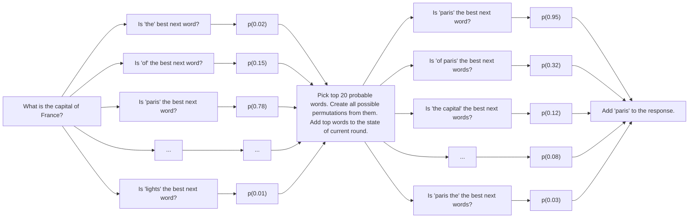

# Jev Talks

**Yet another experiment that checks Jev's talking skills.**


## Run it

```bash
# 1. Copy the example environment file
$ cp .env.example .env

# 2. Paste your TypeSafe API key into the .env file

# 3. Run the talk script with your question
$ uv run talk.py "What is the capital of France?"
```

Use custom dictionary with the `--vocab` flag.
```bash
$ uv run talk.py --vocab basic-english-850.txt "Why is the sky blue?"
```

See some debug info with the `-v` flag.
```bash
$ uv run talk.py -v "What is the most successful scam in history?"
```

Stop a run with Ctrl-C.

## What it says

Real answers, unedited, from the runs used to test this version:

| Question | Answer |
| --- | --- |
| What is the capital of France? | paris |
| Who are you? | i am an assistant |
| Are you conscious? | no |
| Is a hot dog a sandwich? | generally yes |
| Why is the sky blue? | because the air is a filter that allows light through only blue colors |
| What is the meaning of life? | is nothing but process of continuing forward |
| What is love? | is a feeling of connection between people |
| What happens after we die? | is unknown |
| How do I become rich? | start by working hard then save enough money for investment to grow your portfolio |

There was also many uninterested, nonsensical responses, but this is fine.

## How it works

Given the dictionary it evaluates what is the probability of each word being the next word in the sequence. It can be done thanks to the parallel processing of questions on Jev.



## Cost and speed

A round is 4 requests and roughly 110,000 input tokens, which is about half a cent at Jev's list price, and takes about two seconds. Rounds place one or two words, so a twenty-word answer is around 13 rounds, 30 seconds, and 7 cents. Output tokens are free.

## Knobs

All at the top of `talk.py`:

| Setting | Default | What it does |
| --- | --- | --- |
| `LOOKAHEAD` | 3 | scouting asks whether a word could be among the next *n* words |
| `TOP_WORDS` | 30 | scouted words that advance to arranging |
| `PHRASE` | 2 | longest phrase placed in one move; 3 would mean 25,260 phrases per round |
| `TAIL` | 10 | words of the answer quoted in each phrase question, keeping requests inside Jev's 64k-token window |
| `BATCH` | 1000 | words per scouting request |
| `MEMORY` | 10 | recent moves the model gets to see |
| `MAX_ROUNDS` | 50 | hard stop |

## Caveats

- This is a toy. It exists to find out what a decision-only model does when you corner it into generating, not to compete with a language model that is a few hundred times cheaper per word.
- The vocabulary is a web-frequency list of 3,000 words, so it knows "php", "llc" and "faq" but not "purr". Swap in any file with one word per line.
- The vocabulary is lowercase and has no punctuation, so the answers read like telegrams.
- The take-back and pass moves are legal but Jev never picked either in the test runs for this version. Every answer above was written strictly left to right, and the last word of a long answer usually loses to "finish" only by a hair.

## Acknowledgements

Built on [TypeSafe](https://typesafe.ai) and its [Python SDK](https://docs.typesafe.ai/sdk/python). The 850-word list is Ogden's Basic English.
